# Rime — Design Gallery (overnight concepts)

> Generated overnight by an autonomous agent + finished in the morning. Pick a combo to lock in, or use these as starting points for a Claude Design iteration. All artifacts are real, editable SVG / CSS / HTML files — no Figma export needed.

## TL;DR my pick

If you want a default to commit today: **wordmark-02 (frosted-i) + palette-b (slate-tech) + hero-01 (DAG frost) + landing-a (Zama-style)**. The slate-tech palette gives Rime its strongest modern-dev-tool feel; the frost-blue stays for the brand DNA (mark + accent). Reasons in the notes section at the bottom.

---

## 1. Wordmarks

Four genuinely distinct directions. Each is a real SVG at `docs/src/assets/concepts/wordmarks/wordmark-NN-*.svg`.

| Concept | Preview | Notes |
|---|---|---|
| **01 — Minimal** | 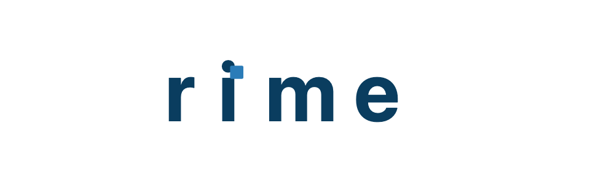 | Lowercase "rime" in Inter Tight 700, "i" dot replaced by a 9px frost-blue square. Safest. Reads as a Vercel/Linear-tier dev tool. |
| **02 — Frosted i** | 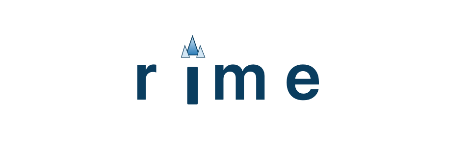 | Three crystalline icicle spikes replace the "i" dot. The only ornamental gesture in the mark — does the brand work without being literal. **My pick** if you want one identifying detail. |
| **03 — Monogram** | 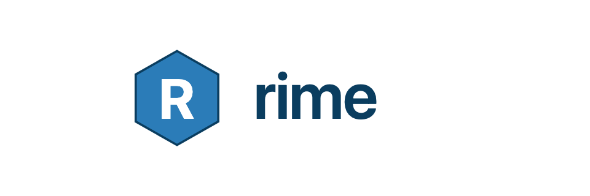 | Hexagonal "R" mark beside the wordmark. The mark stands alone as a favicon. Pick this if you want a separable badge for app icons, GitHub social, etc. |
| **04 — DAG mark** | 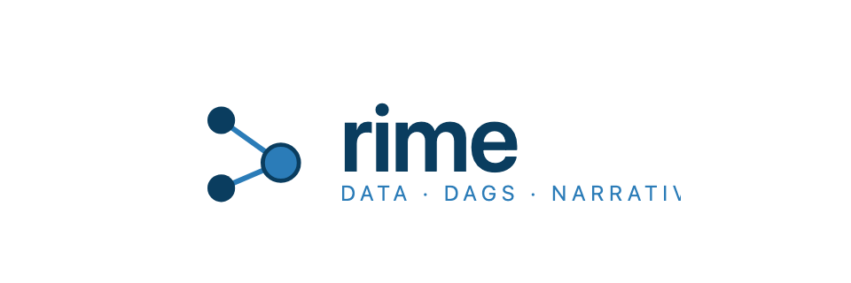 | 3-node DAG glyph + wordmark + small tagline. Telegraphs the product immediately. Best for the landing hero; might be too busy at favicon scale. |

## 2. Palettes (applied live to the Starlight site)

Each variant overrides `--sl-color-accent-*` (and palette-b also overrides bg + text). All three exist as standalone CSS files at `docs/src/styles/concepts/palette-*.css` and are committed alongside the *currently-active* `docs/src/styles/custom.css` (which is palette-a by default).

| Variant | Preview | Notes |
|---|---|---|
| **A — Frost Blue** *(current default)* | 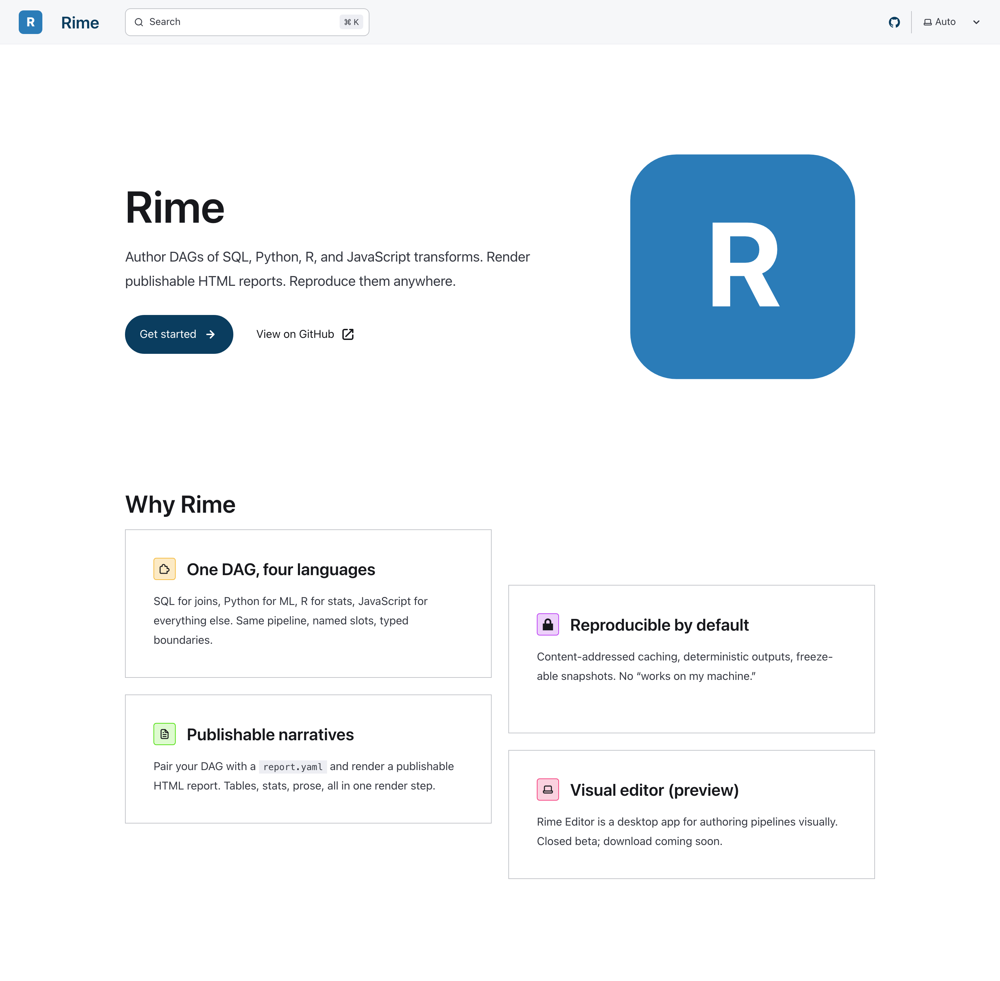 | Classic frost-blue accent (#2b7cb8) on white. Safe, recognizable. Matches the wordmark literally. |
| **B — Slate Tech + Electric** | 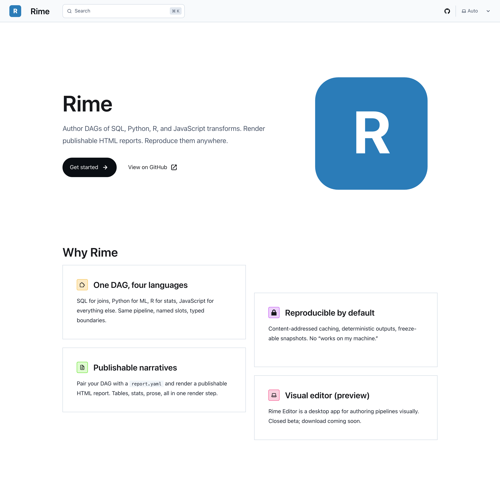 | Cool slate grayscale on near-white with a single electric cyan accent (#0891b2). Vercel / Linear / modern-dev-tool aesthetic. No warm tones anywhere. **My pick** for the strongest tech feel. |
| **C — Monochrome** | 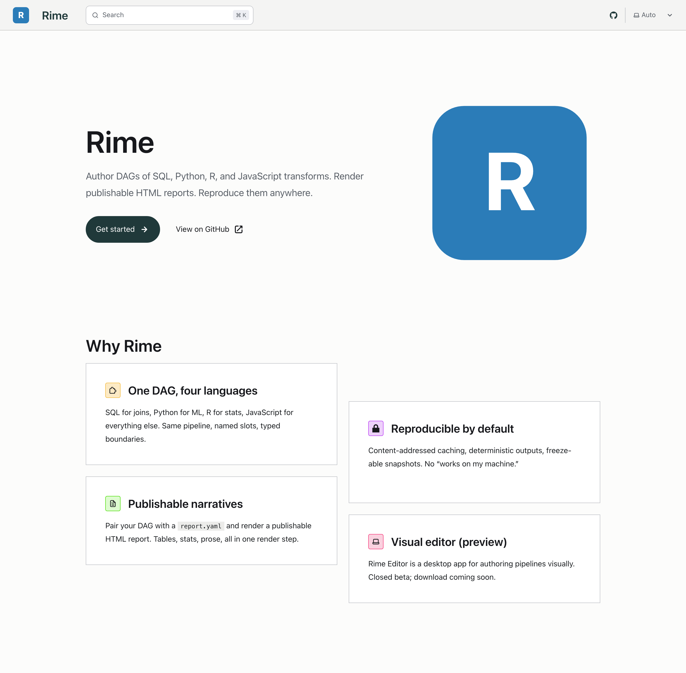 | Slate scale only, no accent color. Closest to NYT / Bloomberg DV aesthetic. Differentiates from every other dev tool but loses the frost identity. |

To switch:
```bash
cd ~/Code/rime/docs
cp src/styles/concepts/palette-X-*.css src/styles/custom.css
npm run build
```

## 3. Hero illustrations

Two compositional approaches. SVGs at 1600×900, vector-only.

| Concept | Preview | Notes |
|---|---|---|
| **01 — DAG Frost** | 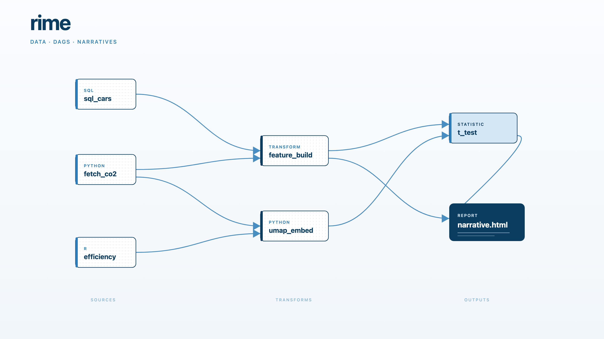 | Three-column DAG flow (Sources → Transforms → Outputs) with frost-pattern dot fills on nodes. Shows what a real Rime pipeline looks like. The terminal report node is the visual climax. **My pick** for the landing hero. |
| **02 — Iso Pipeline** | 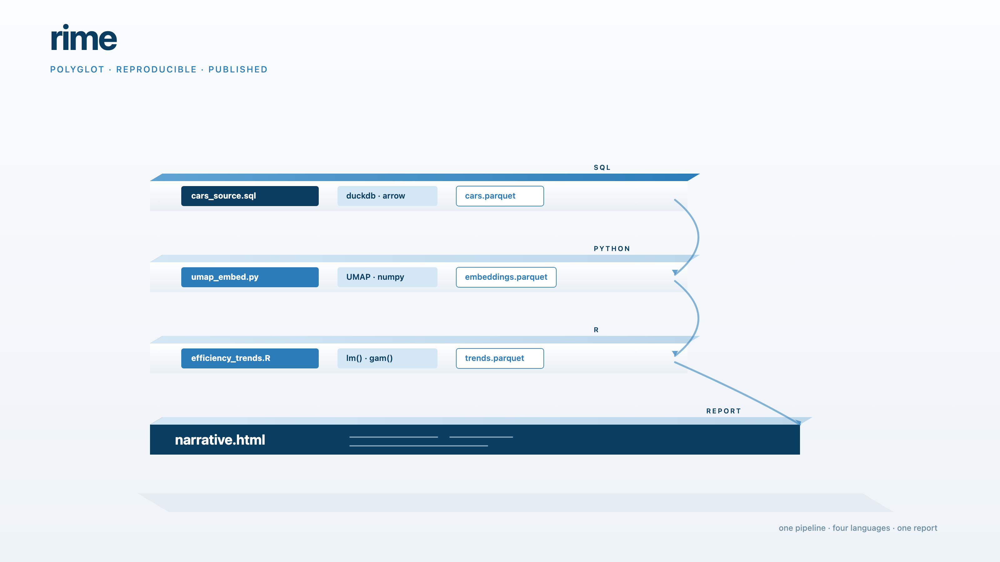 | Isometric stack of language lanes (SQL / Python / R / Output) with stage blocks sliding right. More polished/marketing-y; less "this is how the tool works." |

Files at `docs/src/assets/concepts/heroes/hero-NN-*.svg`.

## 4. Landing layout mockups

Standalone HTML+CSS, no JS, no dependencies. Open with `file://` in a browser to interact, or look at the screenshots below.

| Layout | Preview | Notes |
|---|---|---|
| **A — Zama-style** | 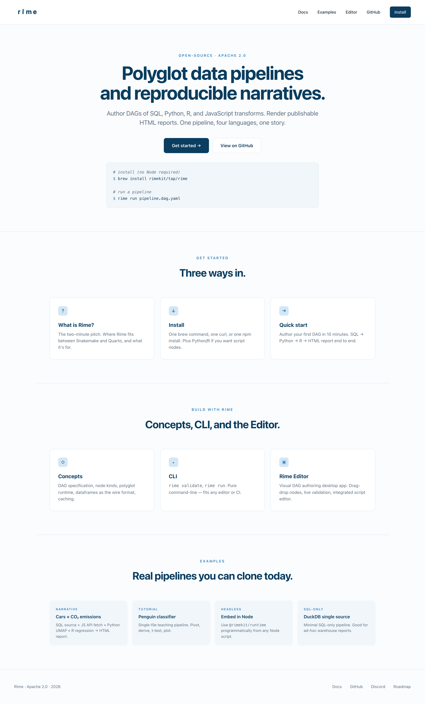 | Centered hero → 3 "get started" cards → 3 "build" cards → examples gallery → footer. Conventional, scannable, fast to grok. Uses palette-a. |
| **B — Longform editorial** | 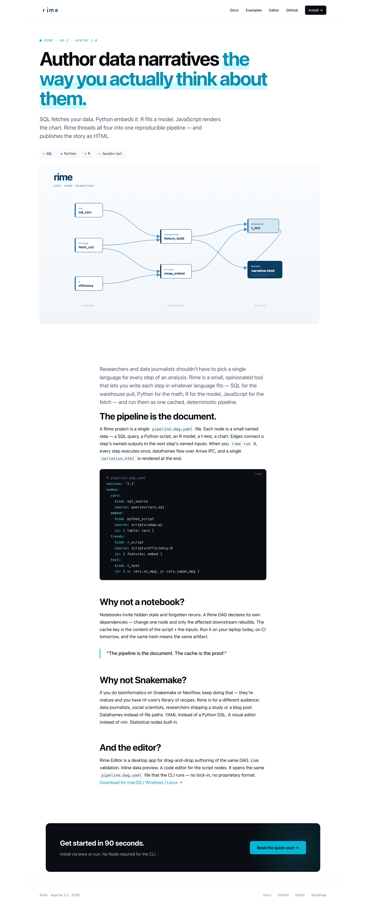 | Single-column scroll. Big asymmetric hero with hero-01 embedded, then editorial prose with an inline YAML code block + pull quote + CTA banner. Uses palette-b (slate-tech): cool grays, electric cyan accent, dark code blocks. Reads as "modern dev tool with editorial polish." |

Files at `docs/src/assets/concepts/landings/landing-{a,b}-*.html`.

---

## Agent's notes / tradeoffs

**On wordmarks.** 01 is the safest forever-choice — it's the kind of wordmark Vercel or Linear would ship. 02 (frosted-i) gives you exactly one brand "thing" to point at, without being literal about snow. 04 (DAG mark) is the most "us" but I don't think it survives at favicon size — the three-node glyph collapses. 03 is the most product-suite-friendly if you ever ship Rime Editor as a separately-branded download with its own icon.

**On palettes.** A is the brand-loyal choice — frost blue on white, exactly what the wordmark uses. B (slate-tech + electric) is the more confident move: cooler grayscale, single electric-cyan accent, no concession to "warmth." It reads more like Linear or Vercel and frankly suits the audience (researchers wanting a serious tool, not a craft product). C drops all color — the most editorial, but you lose the frost identity entirely.

**On heroes.** 01 is honest — it shows a real pipeline structure. The terminal `narrative.html` node is the punchline. 02 is prettier but less informative; it'd land better on a marketing page than a docs site.

**On landings.** A and B are both Rime, just for different rooms. If you're targeting Hacker News on launch day, ship A. If you're targeting Source / DataJournalism.com, ship B. You can probably end up with A as the docs site and B as a separate /story page later.

**On code blocks.** Both landings have meaningful code samples (one shell, one YAML). Both should syntax-highlight properly in production with Shiki or Starlight's built-in. The landing-b code block uses a deep navy background that pairs well with palette-b's cream.

**Things I would change with another pass.**
- The wordmark-02 icicles are slightly cute. A more austere two-spike version might age better.
- Hero-01 could use a subtle data-shape (a tiny table preview) inside one of the transform nodes to make it less abstract.
- Landing-b's "Why not a notebook?" / "Why not Snakemake?" Q&A pattern is too rhetorical — would soften it.

## Next steps

1. Look at the screenshots. Pick: a wordmark + a palette + a hero + a landing direction.
2. Lock the wordmark: copy your pick to `docs/src/assets/logo.svg` and `docs/src/assets/favicon.svg`.
3. Lock the palette: copy your pick from `docs/src/styles/concepts/` to `docs/src/styles/custom.css`. (Palette-a is already there.)
4. Lock the hero: copy your pick to `docs/src/assets/hero.svg` (and reference from `docs/src/content/docs/index.mdx`).
5. If you want to iterate further, open Claude Design with [BRAND_BRIEF.md](BRAND_BRIEF.md) + your chosen concepts as starting input. (Don't start from a blank prompt — start from these.)
6. Once decided, delete `docs/src/assets/concepts/` and `docs/src/styles/concepts/` (or keep them for posterity — they're small).
7. Run through [BRAND_INVENTORY.md](BRAND_INVENTORY.md) to ensure every brand surface (favicon, social card, editor app icon, etc.) gets the new asset.
