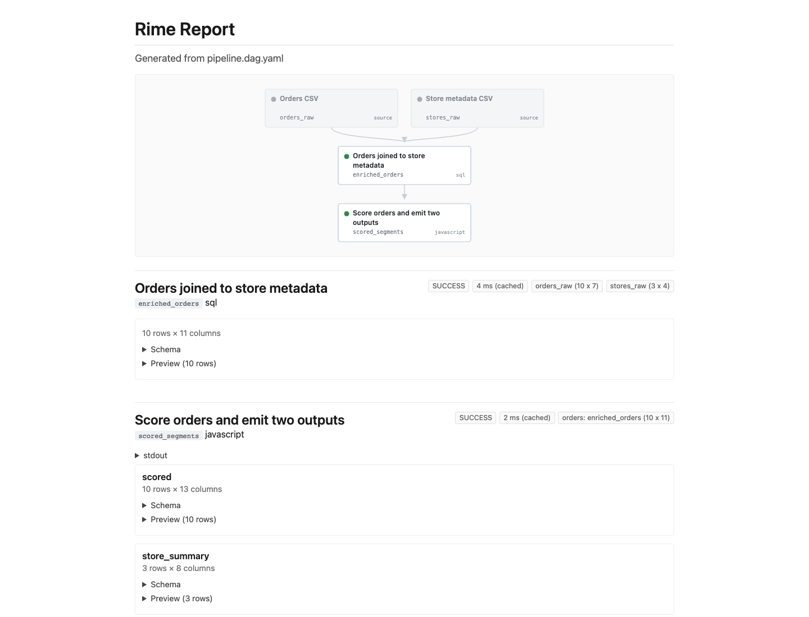

`rime build` runs the DAG and renders an HTML report from the run result. No
separate report file is required.



```bash
rime build pipeline.dag.yaml
```

Every node is included by default. Hide a node with `metadata.report: false`:

```yaml
nodes:
  - id: raw_orders
    kind: source
    path: data/orders.csv
    metadata:
      report: false

  - id: region_totals
    kind: aggregate
    inputs: [clean_orders]
    groupBy: ["[region]"]
    metrics:
      - "[revenue] = [revenue].sum()"
```

## Layout

The generated report is organized by node:

- one section per included node
- node status, cache state, row counts, warnings, stdout, and figures shown once
- one output cell per runtime output
- table outputs show compact shape metadata such as rows and column count
- object/stat outputs show key-value fields and warnings near the result

For multi-output nodes, the node appears once and each output appears underneath
it:

```yaml
- id: segmented
  kind: javascript
  source: scripts/segment.js
  in:
    orders: clean_orders
  out:
    detail: table
    summary: table
```

The report renders `segmented` once, then shows `detail` and `summary` as
separate output cells. Captured stdout and figures stay at the node level so
diagnostics are not duplicated.

## Output rendering

Rime chooses a display based on the actual runtime value:

- table/dataframe outputs render as shape, schema, and preview rows
- stat/object outputs render as key-value tables
- `html_artifact` outputs from `kind: html` or JavaScript nodes render in an iframe
- failed or output-less nodes still render node-level status, warnings, stdout,
  and errors

The report is intentionally review-first. A reader should be able to answer:

- Did this node run or come from cache?
- How many rows and columns did this output produce?
- Are there warnings or captured logs attached to the result?
- Is this a table, a statistical object, or a custom HTML artifact?

For authored browser-side visuals, add a [`kind: html` node](/nodes/html/). The
report embeds its persisted `default.html` artifact without running a browser at
build time.

## Output path

By default, HTML is written next to the DAG under:

```text
outputs/run_report.html
```

Override it with `--out`:

```bash
rime build pipeline.dag.yaml --out outputs/cohort_report.html
```

## Legacy Explicit Reports

Explicit report files are still accepted as a compatibility path:

```bash
rime build pipeline.dag.yaml --report report.yaml
```

Use this only when you need hand-authored prose, custom section ordering, or a
specific column list. The default workflow is DAG-driven report generation.
